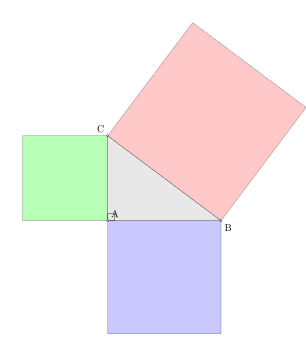
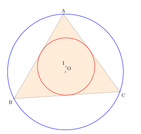
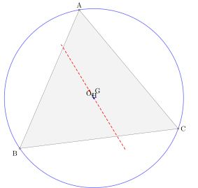

# geometry-diagram-generator

Generate geometric diagrams as SVGs from natural language using an LLM pipeline. The LLM describes geometry in a structured intermediate representation (IR); SymPy does the math; TikZ/LaTeX renders the result.

## Examples

<table>
<tr>
<td align="center"><br/>Pythagorean theorem</td>
<td align="center"><br/>Circumscribed circle</td>
<td align="center"><br/>Euler line</td>
</tr>
</table>

## How it works

```
User request
  → LLM (strategy)
  → DiagramIR (Pydantic schema)
  → SymPy geometry objects       ← source of truth for coordinates
  → Geometric validation
  → TikZ code
  → lualatex (with tkz-euclide) + dvisvgm (Docker)
  → SVG
```

The LLM avoids picking coordinates directly. It describes *what* to construct (midpoints, intersections, circumcenters, etc.); the compiler resolves positions from SymPy.

## Strategies

| Strategy | Description |
|---|---|
| `recipe` | Uses predefined YAML templates for common constructions — the main strategy to use |
| `structured` | Full IR pipeline — LLM outputs DiagramIR JSON directly |
| `python_full` | LLM writes a plain Python construction script against the pydsl builder API |
| `raw_code` | LLM generates TikZ directly |
| `raw_code_with_revise` | Raw TikZ with a revision loop on failure |
| `raw_svg` | LLM generates SVG directly |
| `raw_svg_with_revise` | Raw SVG with a revision loop on failure |

Set the active strategy via `STRATEGY` env var (default: `raw_code`) and the rendering backend via `RENDERER` (`svg` or `tikz`, default: `svg`).

## Quick start

**Prerequisites:** Python 3.11+, [uv](https://github.com/astral-sh/uv), Docker, Node.js + pnpm

```bash
# 1. Install dependencies
uv sync

# 2. Set API keys
# Create a .env with ANTHROPIC_API_KEY (and OPENAI_API_KEY / GOOGLE_API_KEY as needed)

# 3. (Optional) Build and start the TikZ renderer container — only needed for RENDERER=tikz;
#    the default RENDERER=svg renders in-process, no Docker required
docker build -t tikz-renderer renderer/
docker run -p 8001:8001 tikz-renderer

# 4. Start the server
uv run python -m uvicorn main:app

# 5. Start the UI
cd demo-ui && pnpm install && pnpm dev
# Open http://localhost:5173
```

## Development

```bash
# Run tests
uv run python -m pytest tests/

# Run evals
uv run python -m evals.run \
  --scenarios evals/scenarios.yaml \
  --strategies structured \
  --model anthropic:claude-sonnet-4-6 \
  --repeats 3 \
  --output evals/results

# Start eval viewer
uv run python evals/eval_viewer.py   # backend on :8002
cd eval-viewer-ui && pnpm dev        # frontend proxies /api to :8002
```

## Project layout

```
geometry_diagrams/        Core package (also the unit copied into other projects)
  ir/                        Intermediate representation: schema, SymPy compiler, TikZ/SVG emitters, checks
  strategies/                LLM strategy implementations
  recipe/                    Declarative DSL + YAML templates for common constructions
  pydsl/                     Python-native DSL: builder-shim API + sandboxed script execution
  util/                      Shared utilities (renderer client, SVG/TikZ checks, LLM judge)
renderer/                  Docker container: FastAPI server wrapping lualatex + dvisvgm
evals/                     Benchmark harness, scenarios, result viewer
demo-ui/                   Vite frontend (served from / by main.py once built)
eval-viewer-ui/            Vite frontend for browsing eval results
docs/                      DSL specification (geometry-dsl-spec.md) and rendered examples
tests/                     Unit and integration tests
```

## Architecture notes

- See [CLAUDE.md](CLAUDE.md) for the full pipeline description and design rationale.
- See [docs/geometry-dsl-spec.md](docs/geometry-dsl-spec.md) for the IR schema specification.
- The renderer container exposes `POST /render` (TikZ → SVG) and `GET /health` on port 8001.
- **LangGraph** and **LangChain** are used for LLM agent orchestration, with Anthropic, OpenAI, and Google backends.
