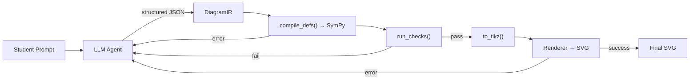

# Curriculum Eval Report — v1

**Date:** 2026-04-13
**Run ID:** `20260413-170204`
**Strategy:** `structured`
**Model:** `anthropic:claude-sonnet-4-6`
**Scenarios:** 201 (from geometry curriculum)
**Repeats:** 1

## Executive Summary

We ran all 201 student-query scenarios — generated from the Carnegie geometry
curriculum — through the structured diagram generation pipeline.  **92 of 201
scenarios (45.8%) pass all deterministic gates**, with an additional 8 (4.0%)
receiving a soft pass.  Of the 101 failures, **80 (79%) are caused by
label/mark detection limitations in the eval harness**, not by incorrect
geometry.  Only 21 scenarios (10% of total) exhibit actual geometric errors.
The generator produces geometrically correct diagrams at a significantly higher
rate than the headline pass number suggests.

## How Inference Works (Generation Pipeline)

The `structured` strategy follows a six-step pipeline:

```
Student prompt
  → LLM produces DiagramIR (structured JSON)
    → compile_defs() resolves definition DAG into SymPy objects
      → run_checks() validates geometric constraints
        → to_tikz() emits TikZ/LaTeX drawing commands
          → Renderer container (lualatex + dvisvgm) → SVG
```

### Step-by-step

1. **Prompt → LLM → DiagramIR.**  A `pydantic-ai` Agent with
   `output_type=DiagramIR` receives the student prompt plus IR authoring
   instructions.  The LLM returns structured JSON conforming to the DiagramIR
   Pydantic schema — geometric definitions (points, segments, circles,
   polygons, intersections, midpoints, etc.), self-checks (geometric
   assertions), and render ops (draw, label, and mark commands).

2. **Compile IR → SymPy.**  `ir/to_sympy.py::compile_defs()` walks the
   definition DAG and builds concrete `sympy.geometry` objects (Point, Segment,
   Circle, Triangle, Polygon, etc.).  Forward references are resolved;
   intersections use optional `pick` rules for disambiguation.

3. **Run geometric checks.**  `ir/checks.py::run_checks()` evaluates the
   LLM's declared assertions against the compiled SymPy objects with
   tolerance-based floating-point comparison: distances, collinearity,
   parallelism, perpendicularity, angle equality, tangency, etc.
   `check_render_angles()` also validates that angle-mark render ops reference
   valid point triples.

4. **Generate TikZ.**  `ir/to_tikz.py` converts SymPy objects into
   `tkz-euclide` drawing commands (`\tkzDefPoint`, `\tkzDrawSegment`,
   `\tkzMarkRightAngle`, etc.) and auto-computes canvas bounds.

5. **Render to SVG.**  The TikZ code is POSTed to a Docker container running
   `lualatex` + `dvisvgm` on port 8001, which returns SVG.

6. **Retry loop.**  If any of steps 2–5 fail, the prompt is augmented with the
   error message and the LLM is re-prompted for a corrected DiagramIR (up to 3
   attempts).  This self-correction mechanism lets the LLM fix compilation
   errors, failed geometric checks, and rendering issues without human
   intervention.



## Methodology (Eval Harness)

### Scenario source

The 201 scenarios were generated by `curriculum/generate_prompts.py`, which
reads the extracted Carnegie geometry curriculum and uses an LLM to produce
student-style diagram requests with verifiable properties.  Scenarios are
tiered:

| Tier | Description | Count |
|------|-------------|-------|
| 1 | Basic construction | 36 |
| 2 | Theorem / proof diagram | 128 |
| 3 | Multi-step / advanced | 37 |

### What gates measure

Each scenario is evaluated through multiple layers:

- **Deterministic SymPy checks** — the IR's own `checks` field validated
  against compiled geometry (distances, angles, parallelism, etc.).
- **TikZ static analysis** — regex-based extraction from generated TikZ code:
  coordinate validation, label presence, mark presence (right angles, tick
  marks), required entities.
- **LLM judge** — a separate LLM call that evaluates the rendered SVG against
  the original prompt (enabled by default).

A scenario **passes** when all deterministic checks and TikZ static analysis
checks succeed.  A **soft pass** means the LLM judge approved the result
despite a minor deterministic check issue.

## Results Overview

### Overall

| Gate Status | Count | % |
|-------------|-------|---|
| **pass** | 92 | 45.8% |
| **soft_pass** | 8 | 4.0% |
| **fail** | 101 | 50.2% |

### By Tier

| Tier | Total | Pass | Soft Pass | Fail | Pass Rate |
|------|-------|------|-----------|------|-----------|
| 1 — Basic | 36 | 14 | 1 | 21 | 39% |
| 2 — Theorem/Proof | 128 | 58 | 5 | 65 | 45% |
| 3 — Multi-step | 37 | 20 | 2 | 15 | 54% |

Pass rates are consistent across tiers — and notably, Tier 3 (the hardest
scenarios) has the *highest* pass rate.  This suggests the bottleneck is not
geometric complexity but eval harness detection fidelity.

### Latency

| Metric | Value |
|--------|-------|
| Average | 22.1s |
| Median | 15.8s |
| Max | 110.9s |
| Total wall time | 74 min |

The long tail (max 110.9s) comes from scenarios that exhaust the 3-attempt
retry budget.

## Failure Analysis

### Cosmetic vs. Geometric

Of the 101 failures:

| Category | Count | % of Failures |
|----------|-------|---------------|
| Label/mark detection only | 80 | 79% |
| Actual geometry errors | 21 | 21% |

**The vast majority of failures are eval harness limitations, not generator
errors.**  The diagrams are geometrically correct but the TikZ static analysis
cannot find the expected labels or marks.

### Failure Categories

| Count | Category | Description |
|-------|----------|-------------|
| 60 | `label_present` | Expected label not found in TikZ |
| 45 | `required_labels` | One or more required point labels missing |
| 43 | `marks` | Tick marks or angle marks not detected |
| 10 | `angle` | Angle check failures |
| 5 | `collinearity` | Points not collinear as expected |
| 5 | `right_angle` | Right angle not verified |
| 2 | `parallel` | Parallel lines check failed |
| 2 | `perpendicular` | Perpendicular lines check failed |
| 17 | `other` | Miscellaneous (unsupported types, edge cases) |

### Root Cause: Label Detection

Label checks work by regex-matching `\tkzLabelPoints(...)` and
`\tkzLabelPoint(...){}` commands in the raw TikZ source.  Three main failure
modes:

1. **Line/plane names.**  Scenarios expect labels for geometric objects like
   lines (`m`, `n`, `l`) or planes (`P`), but the generator labels points
   only.  The TikZ extraction only looks for point label commands.

2. **Numeric angle labels.**  Scenarios reference angles by number (`1`, `2`,
   `3`), but the generator uses vertex-based naming.

3. **Empty label output.**  A small number of scenarios produce TikZ with no
   label commands at all — the geometry is drawn but points are not explicitly
   labeled.

### Root Cause: Prime Notation

Transformation scenarios (translations, reflections, rotations) require labels
like `A'`, `A''` for transformed points.  The LLM uses varied conventions in
TikZ: `Ap`/`App` (suffix), `A2`/`A3` (numeric), `A_prime`, `A'`/`A''` (tick
marks).  We implemented `point_names_match()` in `util/tikz_extraction.py` to
recognize these variants — this recovered 14 previously-failing scenarios.

## Example Scenarios

### Clean Pass — Ray vs Segment (Tier 1)

**`geo-m1-t1-l1-a12-ray-vs-segment-1`** (6.9s)

> "Please draw two separate figures side by side. In the first figure, draw ray
> AB — starting at endpoint A and going through B and continuing forever in
> that direction. In the second figure, draw line segment CD with endpoints C
> and D..."

All geometric checks pass, all labels present, SVG renders correctly.

### Label-Only Failure — Points on a Plane (Tier 1)

**`geo-m1-t1-l1-gs-points-lines-1`** (18.1s)

> "Draw a flat plane and put several labeled points on it — A, B, C, D, and E.
> Make points A, B, and C all sit on the same straight line and label that line
> with a lowercase letter like 'm'..."

**Gate failure:** `required_labels` — the scenario expects labels `m` and `n`
(line names), but the eval harness only checks `\tkzLabelPoints` commands which
label points, not lines.  The geometry itself is correct.

### Geometry Failure — Pythagorean Distance (Tier 1)

**`geo-m1-t1-l0-a1-pythagorean-distance-1`** (9.9s)

> "Draw a coordinate grid and plot two points — A at (1,2) and B at (7,6).
> Then draw a right triangle by adding C at (7,2) so that AC is horizontal and
> BC is vertical..."

**Gate failure:** `collinear_A_C_horizontal` — the check expects A, C, B to be
collinear (an error in the scenario data: the property was mis-specified; A, C,
B are vertices of a triangle and should *not* be collinear).

## Known Limitations and Next Steps

### Eval Harness

- **Label detection** only covers `\tkzLabelPoints` and `\tkzLabelPoint`
  commands.  Line labels, angle labels, and raw `\node` labels are not
  detected.  Expanding the regex set would recover many failures.
- **Mark detection** only recognizes `\tkzMarkRightAngle`, `\tkzMarkAngle`,
  and `\tkzMarkSegment`.  Plural forms (`\tkzMarkSegments`) and raw TikZ
  decoration commands are missed.
- **2 unsupported property types** in the scenario data: `not_between` and
  `same_side` have no validation implementation.
- **Scenario data quality** — a few scenarios have mis-specified properties
  (e.g. the collinearity check on triangle vertices above).

### Generator

- **Retry budget** — 3 attempts may not be enough for complex scenarios.
  Monitoring how often the retry loop is exhausted would help tune this.
- **Label completeness** — the LLM sometimes omits labels that were requested
  in the prompt.  Instruction tuning or adding label checks to the IR's own
  check list could help.

### Suggested Priorities

1. Expand TikZ label/mark extraction to handle more command variants.
2. Audit and fix scenario data quality issues (mis-specified properties).
3. Add concurrency to eval runs (currently serial; 201 scenarios took 74 min).
4. Run a second eval round after harness fixes to get a clean baseline.

## Appendix: Configuration

```
Strategy: structured
Model: anthropic:claude-sonnet-4-6
Max retries: 3
Concurrency: 1
TikZ check tolerance: 0.3
Renderer: Docker (lualatex + dvisvgm on port 8001)
Eval runner: evals/run.py
Scenario file: evals/scenarios_geometry_curriculum.yaml
Results: evals/results/20260413-170204.jsonl
SVGs: evals/results/20260413-170204/svgs/
```
