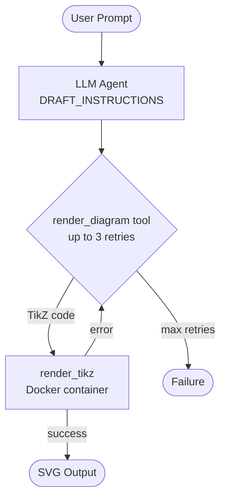
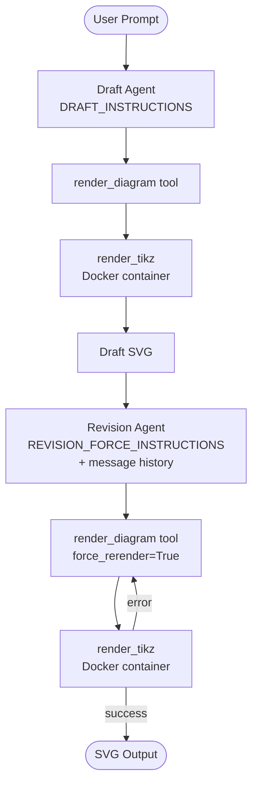
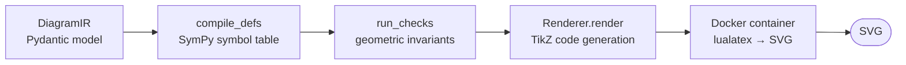
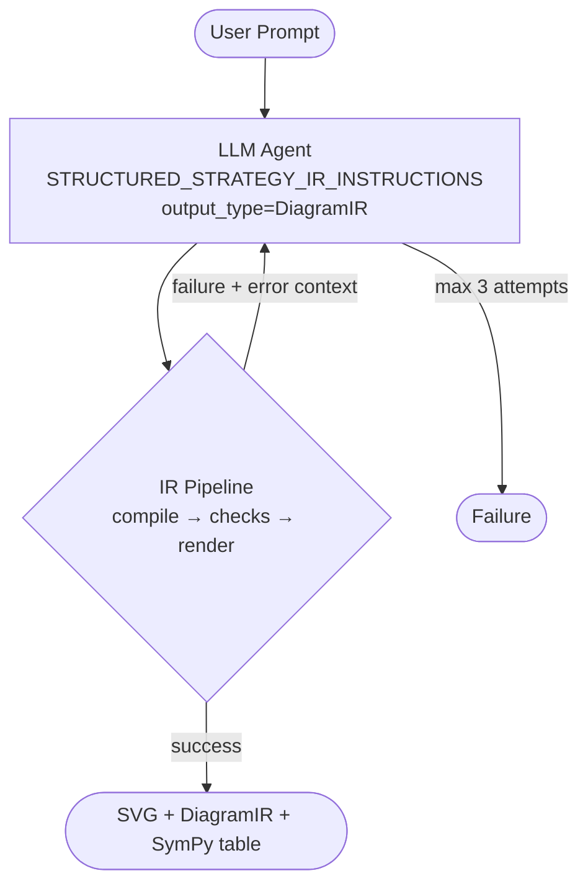
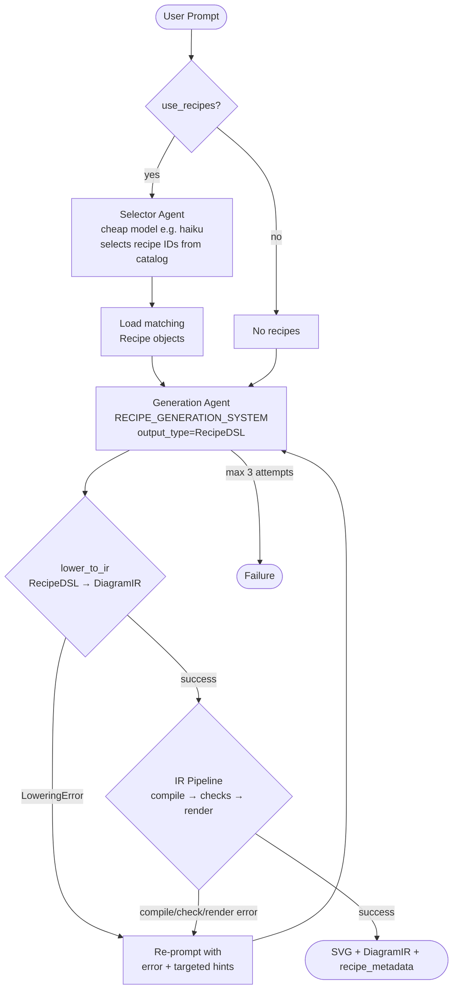
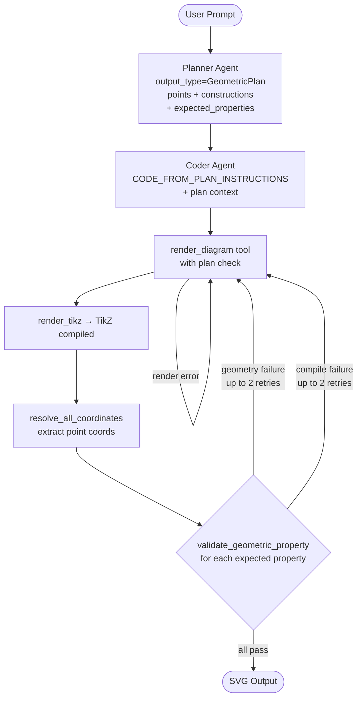
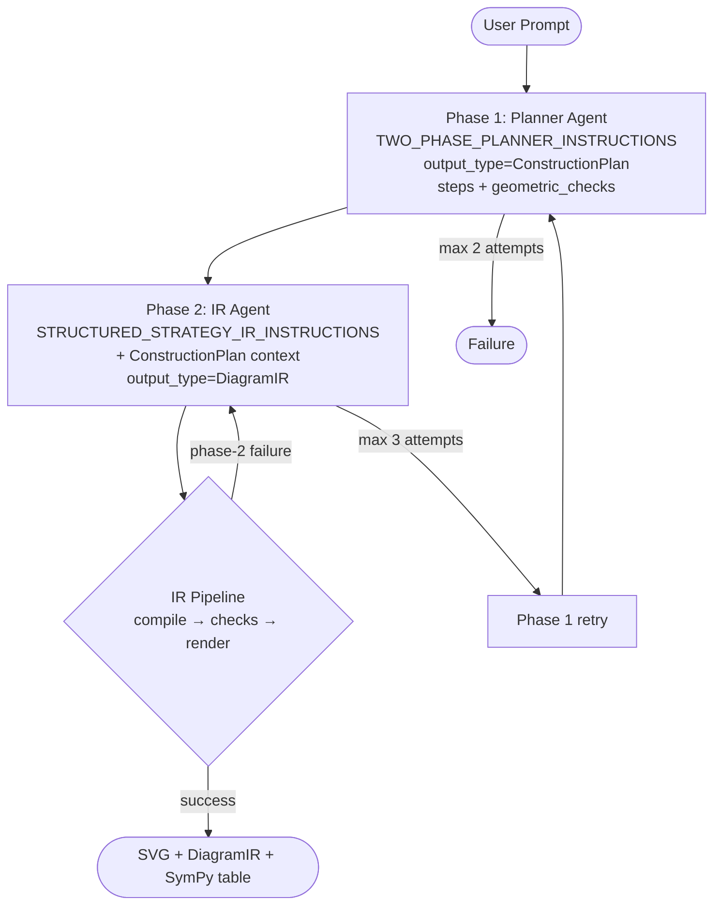
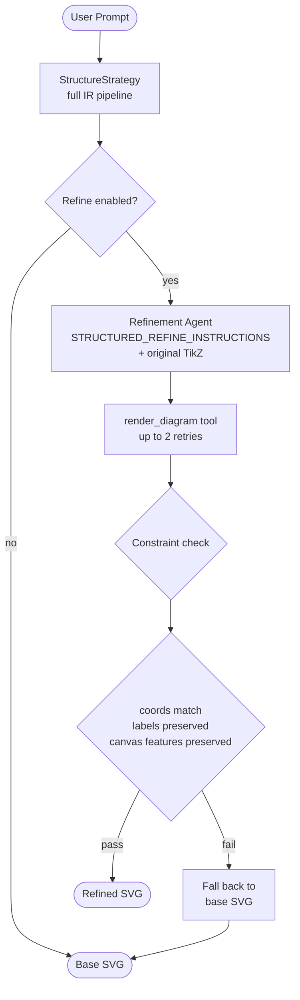
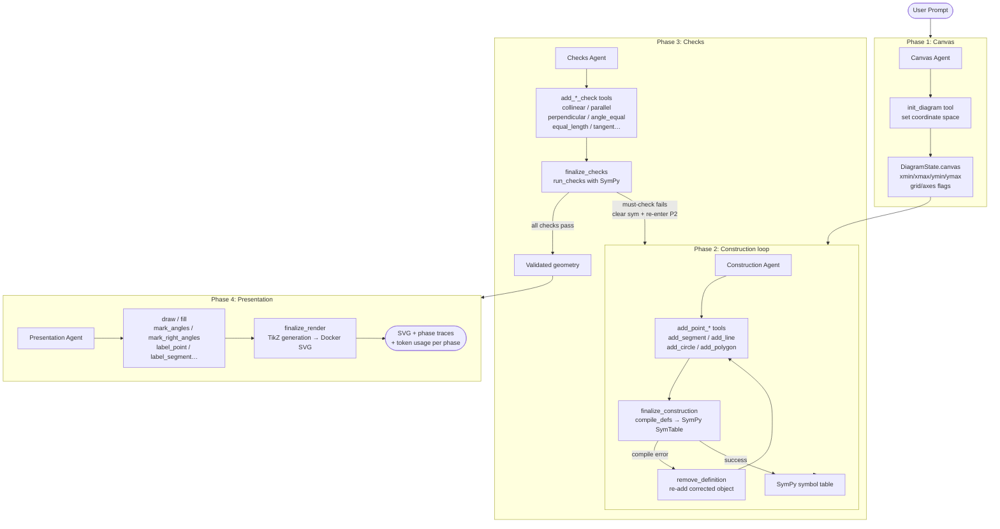
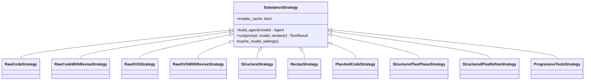

# Geometry Diagram Strategies

All strategies implement the `SubstanceStrategy` base class (`strategies/base.py`) and produce SVG output from a natural-language geometry prompt.

---

## Strategy Comparison

| Strategy | LLM Stages | IR Pipeline | Retry / Repair | Geometric Verification |
|---|---|---|---|---|
| `RawCodeStrategy` | 1 | No | Tool retries (3x) | None |
| `RawCodeWithReviseStrategy` | 2 | No | Mandatory revision pass | None |
| `RawSVGStrategy` | 1 | No | Tool retries (3x) | SVG format check |
| `RawSVGWithReviseStrategy` | 2 | No | Mandatory revision pass | SVG format check |
| `StructureStrategy` | 1 (retried) | Yes | Compile/check/render feedback | SymPy checks |
| `RecipeStrategy` | 1–2 (optional selector) | Yes | DSL + lowering feedback | SymPy checks |
| `PlanAndCodeStrategy` | 2 (plan → code) | No | Coordinate self-check | Property validation |
| `StructuredTwoPhaseStrategy` | 2 (plan → IR) | Yes | IR feedback | SymPy checks |
| `StructuredPlusRefineStrategy` | 1 + optional refine | Yes | Base IR + constraint check | Coord/label preservation |
| `ProgressiveToolsStrategy` | 4 (canvas/construct/checks/present) | Yes | Tool-based repair loop | Real-time SymPy checks |

---

## Raw Strategies

### `RawCodeStrategy` (`strategies/raw_code.py`)

The LLM writes TikZ code directly. No IR, no geometric verification.

---

### `RawCodeWithReviseStrategy` (`strategies/raw_code_with_revise.py`)

Two-pass TikZ generation: a draft agent followed by a mandatory revision agent that reviews and re-renders.

---

### `RawSVGStrategy` (`strategies/raw_svg.py`)

The LLM writes SVG directly. Validated only for well-formed `<svg>` element structure.

---

### `RawSVGWithReviseStrategy` (`strategies/raw_svg_with_revise.py`)

Two-pass SVG generation with a mandatory revision agent.

---

## IR-Based Strategies

These strategies share a common IR compilation pipeline once the LLM produces a `DiagramIR`:

---

### `StructureStrategy` (`strategies/structured.py`)

LLM generates `DiagramIR` JSON directly. Compile errors and check failures are fed back as retry context.

---

### `RecipeStrategy` (`strategies/recipe.py`)

The primary production strategy. Optionally uses a cheap selector model to pick relevant recipes from a catalog, then generates a `RecipeDSL` that is lowered to `DiagramIR`.

---

### `PlanAndCodeStrategy` (`strategies/plan_and_code.py`)

Two-stage: a planner produces a `GeometricPlan` with expected properties, then a coder generates TikZ and validates coordinate geometry against the plan.

---

### `StructuredTwoPhaseStrategy` (`strategies/structured_two_phase.py`)

A natural-language `ConstructionPlan` is produced first, then translated to `DiagramIR`. Designed for head-to-head comparison with `StructureStrategy`.

---

### `StructuredPlusRefineStrategy` (`strategies/structured_plus_refine.py`)

Runs `StructureStrategy` to get a verified TikZ base, then optionally runs a refinement agent to improve visual presentation. Falls back to the base result if refinement violates geometric constraints.

---

### `ProgressiveToolsStrategy` (`strategies/progressive_tools/`)

A four-phase strategy where each phase has dedicated tools. Geometric checks happen in real-time during construction. A repair loop removes and re-adds failing objects.

---

## Base Class (`strategies/base.py`)

